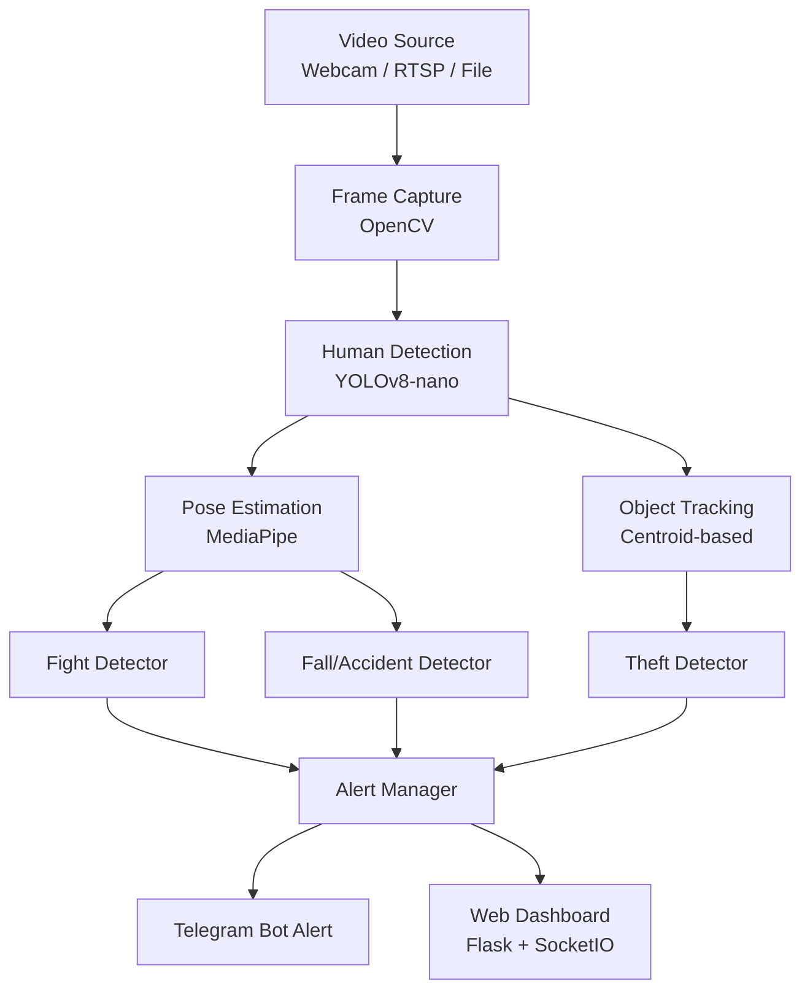

# AI CCTV Anomaly Detection System — Implementation Plan

Build a real-time AI system that processes CCTV/webcam feeds to detect **fights, accidents, theft, and suspicious movement**, and alerts security personnel instantly.

## System Architecture



## Core Features

| # | Feature | Detection Method | Key Signals |
|---|---------|-----------------|-------------|
| 1 | **Fight Detection** | Pose + motion | Rapid arm movement, close proximity, aggressive poses |
| 2 | **Accident / Fall** | Pose analysis | Sudden vertical drop, horizontal body position |
| 3 | **Theft Detection** | Object + trajectory | Rapid grab motion + running away from an area |

## Tech Stack (All Free & Open Source)

- **Python 3.10+** — Core language
- **OpenCV** — Video capture & frame processing
- **Ultralytics YOLOv8-nano** — Fast person/object detection (runs well on M2)
- **MediaPipe** — Lightweight pose estimation (33 body landmarks)
- **Flask + Flask-SocketIO** — Real-time web dashboard
- **python-telegram-bot** — Telegram Bot API for instant alerts to security personnel

---

## Proposed Changes

### Phase 1: Project Setup & Video Pipeline

#### [NEW] [requirements.txt](file:///Users/madhurjya/Documents/Bitcoin2009/requirements.txt)
All Python dependencies: `opencv-python`, `ultralytics`, `mediapipe`, `flask`, `flask-socketio`, `plyer`, `pygame`, `numpy`.

#### [NEW] [config.py](file:///Users/madhurjya/Documents/Bitcoin2009/config.py)
Central configuration — detection thresholds, video source URI, alert cooldowns, model paths. All tunable from one file.

#### [NEW] [capture.py](file:///Users/madhurjya/Documents/Bitcoin2009/capture.py)
Video capture module — reads frames from webcam, RTSP stream, or video file via OpenCV. Handles reconnection and frame-rate throttling.

---

### Phase 2: Human Detection (YOLOv8)

#### [NEW] [detector.py](file:///Users/madhurjya/Documents/Bitcoin2009/detector.py)
Wraps `ultralytics` YOLOv8-nano (`yolov8n.pt`). Runs inference on each frame, returns bounding boxes + confidence for detected persons. Includes simple ID tracking across frames using centroid-based matching.

---

### Phase 3: Pose Estimation (MediaPipe)

#### [NEW] [pose_estimator.py](file:///Users/madhurjya/Documents/Bitcoin2009/pose_estimator.py)
Uses MediaPipe Pose to extract 33 body landmarks for each detected person crop. Calculates derived features: joint angles, body tilt, limb velocities.

---

### Phase 4: Fight Detection

#### [NEW] [analyzers/fight_detector.py](file:///Users/madhurjya/Documents/Bitcoin2009/analyzers/fight_detector.py)
Detects fights using:
- **Proximity check** — two persons within close distance
- **Rapid arm motion** — wrist velocity exceeds threshold over N frames
- **Aggressive pose** — arm extension angles consistent with punching/pushing
- Sliding window of last ~15 frames for temporal smoothing

---

### Phase 5: Accident / Fall Detection

#### [NEW] [analyzers/fall_detector.py](file:///Users/madhurjya/Documents/Bitcoin2009/analyzers/fall_detector.py)
Detects falls using:
- **Vertical drop** — hip Y-coordinate drops rapidly (>X pixels/frame)
- **Aspect ratio** — bounding box switches from tall to wide
- **Body angle** — torso angle exceeds horizontal threshold
- Requires condition to persist for ~0.5s to avoid false positives

---

### Phase 6: Theft Detection

#### [NEW] [analyzers/theft_detector.py](file:///Users/madhurjya/Documents/Bitcoin2009/analyzers/theft_detector.py)
Detects grab-and-run using:
- **Sudden speed increase** — person velocity spikes after being near another person or stationary object
- **Rapid arm extension** — grab gesture followed by running pose
- Combines trajectory + pose signals

---

### Phase 7: Alert & Notification System (Telegram)

#### [NEW] [alert_manager.py](file:///Users/madhurjya/Documents/Bitcoin2009/alert_manager.py)
- Receives anomaly events from all detectors
- De-duplicates alerts with a cooldown period (configurable, default 30s)
- Sends **Telegram message** with event type, timestamp, and annotated screenshot to a security chat/group
- Also pushes event to web dashboard via SocketIO
- Logs all events with timestamp + type + screenshot to `alerts/` folder

---

### Phase 8: Web Dashboard & Main Entry Point

#### [NEW] [dashboard.py](file:///Users/madhurjya/Documents/Bitcoin2009/dashboard.py)
Flask + SocketIO server serving:
- Live video feed (MJPEG stream with detection overlays)
- Real-time alert log (pushed via WebSocket)
- Detection toggle controls

#### [NEW] [templates/index.html](file:///Users/madhurjya/Documents/Bitcoin2009/templates/index.html)
Dashboard UI — live video player, alert feed, status indicators, detection toggles.

#### [NEW] [static/style.css](file:///Users/madhurjya/Documents/Bitcoin2009/static/style.css)
Dashboard styling — dark theme, modern design.

#### [NEW] [main.py](file:///Users/madhurjya/Documents/Bitcoin2009/main.py)
Entry point that wires everything together:
1. Starts video capture
2. Runs detection pipeline per frame
3. Feeds results into analyzers
4. Triggers alerts
5. Streams annotated frames to dashboard

---

## Directory Structure

```
Bitcoin2009/
├── main.py                  # Entry point
├── config.py                # All thresholds & settings (+ Telegram bot token/chat ID)
├── capture.py               # Video capture
├── detector.py              # YOLOv8 person detection + tracking
├── pose_estimator.py        # MediaPipe pose
├── alert_manager.py         # Telegram alerts & logging
├── dashboard.py             # Flask web dashboard
├── requirements.txt
├── analyzers/
│   ├── __init__.py
│   ├── fight_detector.py
│   ├── fall_detector.py
│   └── theft_detector.py
├── templates/
│   └── index.html
├── static/
│   └── style.css
└── alerts/                  # Auto-created, stores event screenshots
```

## Verification Plan

### Phase-by-Phase Testing

Each phase will be verified before moving to the next:

1. **Video Pipeline** — Run `main.py` and confirm webcam feed displays in browser at `/` route
2. **Human Detection** — Verify bounding boxes drawn around detected persons on the live feed
3. **Pose Estimation** — Verify skeleton overlay on detected persons
4. **Fight Detection** — Test with a fight clip or simulated arm waving, confirm alert fires
5. **Fall Detection** — Simulate a fall in front of webcam, verify detection
6. **Theft Detection** — Simulate grab-and-run motion, verify alert
7. **Alerts** — Confirm Telegram message arrives with screenshot for each event
8. **Dashboard** — Verify live stream, alert feed, and toggle controls work in browser

### Manual Verification (User)
- Walk in front of the webcam and perform various actions to test each detector
- Check Telegram for incoming alert messages with screenshots
- Check the `alerts/` folder for saved event screenshots
- Toggle detectors on/off via the dashboard and confirm they respond

> [!IMPORTANT]
> We will implement this **one phase at a time** as requested. After each phase, we'll test it before moving to the next.
